# Prefácio {-}

Este material foi escrito no semestre de 2020/1, no qual a professora Márcia Barbian me deu a tarefa de construir um site para a disciplina de MAT02219 - Probabilidade e Estatística EAD. O objetivo deste material é fornecer um guia para que professores, monitores e colaboradores da disciplina possam fazer a manutenção do site sem precisar aprender o funcionamento do pacote `Blogdown` e do `Hugo` do zero.

Eu assumo que a pessoa que estiver lendo este material sabe pouco ou nada de programação em html, css ou java script e que também não sabe como o pacote `Blogdown` do R e o gerador de sites estáticos `Hugo` funcionam. Eu não tenho conhecimento aprofundado em nenhuma dessas ferramentas citadas, não esperem nada muito profissional aqui, apenas o necessário para gerir o site.

Por fim, estou assumindo que o repositório do site ainda se encontra em [https://github.com/Probabilidade-e-Estatistica-EAD/site](https://github.com/Probabilidade-e-Estatistica-EAD/site).

# Como rodar o site localmente

1 - Escolha o diretório onde a pasta do projeto irá ficar. Como exemplo, criei uma pasta com alguns projetos e incluirei o site como um deles.

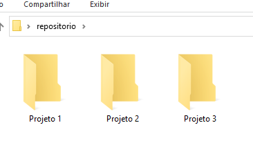

2 - Digite "cmd" no endereço da pasta e tecle enter, isso vai abrir o prompt de comando na pasta

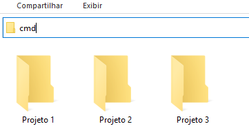


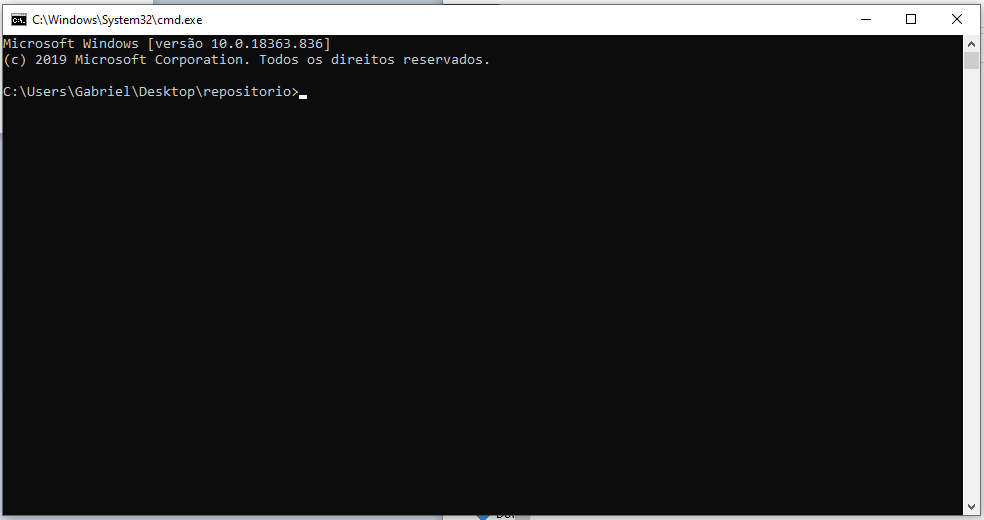

3 - Assumindo que você tenha o git instalado no seu computador, digite o comando `git clone https://github.com/Probabilidade-e-Estatistica-EAD/site`. Isso irá clonar o repositório do github e linkar o projeto do R ao endereço do repositório.

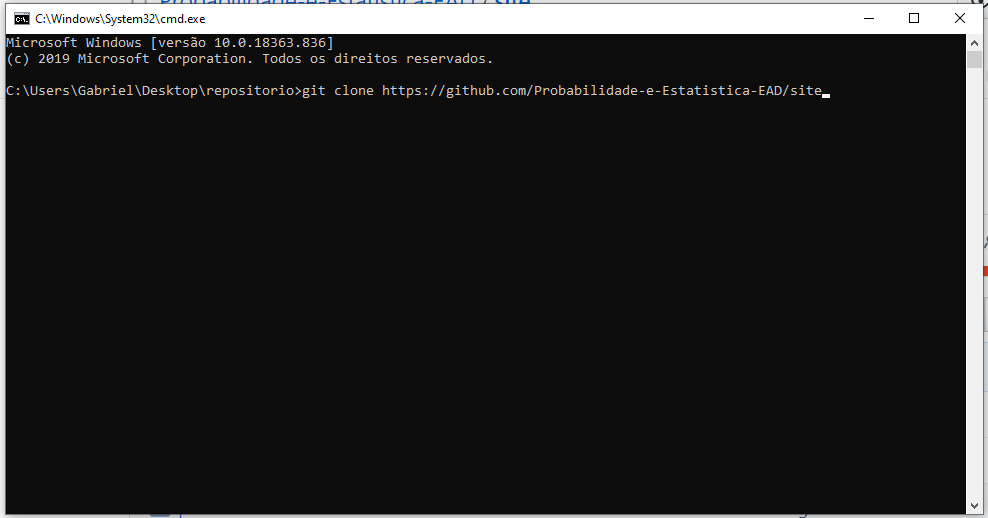

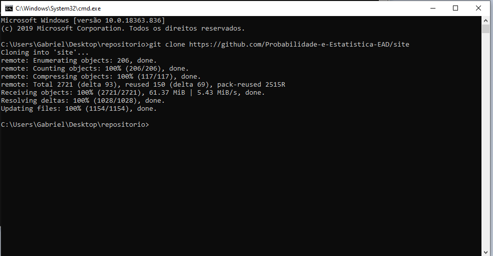

4 - Agora que a pasta do site está no nosso repositório, abra o arquivo `prob_est_site.Rproj`

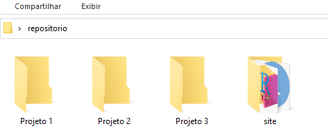

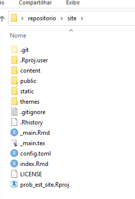


5 - Baixe o pacote `Blogdown` e o `Hugo` usando os comandos abaixo

```{r eval=FALSE, echo=TRUE, warning=FALSE,message=FALSE}

install.packages('blogdown')
blogdown::install_hugo()

```

6 - Na aba `Addins` clique em `Serve Site`, ou rode o comando `blogdown::serve_site()` no console. Este comando irá servir o site em um servidor local o que nos permitirá ver o site.

 
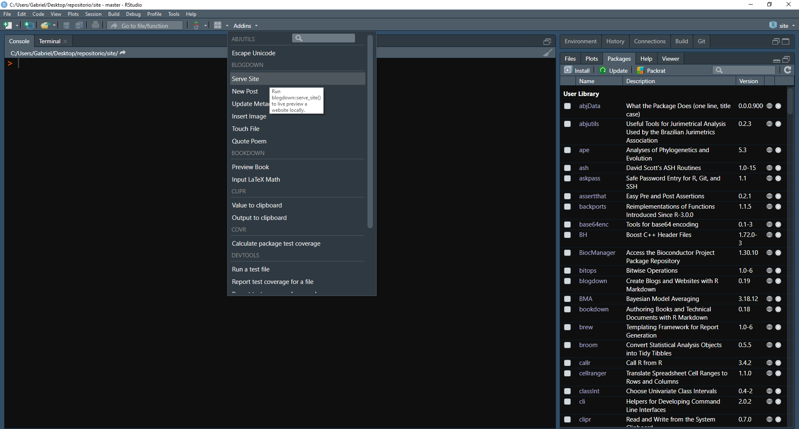

7 - O ambiente deve se parecer com isto

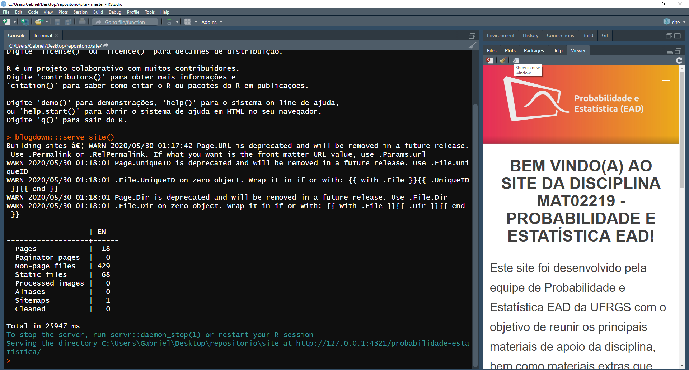

Para visualizar o site no browser, clique na opção "Show in new window" na aba "Viewer".

Não é possível ver o website de outra maneira a não ser esta. Não há um arquivo html que possamos abrir e facilmente ter uma visão geral, como no output em html do Rmarkdown.

# Pastas e arquivos principais

No projeto, algumas pastas e arquivos têm importância fundamental para a construção do site e na maioria dos casos **precisam** ter um nome específico. Vamos ver algumas delas agora. 

## public

A pasta public é o site propriamente dito. Isso significa que é esta pasta apenas que iremos uppar no endereço web. Ao executar a função `serve_site()`, todos os arquivos de outras pastas têm o propósito de agregar conteúdo ao site ou juntar os pedaços de código espalhados pelo diretório a fim de criar o site.


Se você já usou o pacote `Bookdown`, deve ter notado que ele cria mais de um arquivo html e também algumas pastas, diferente do output em html do Rmarkdown, que é apenas um arquivo html. Isso acontece porque no `Bookdown`, cada html é um capítulo ou subcapítulo do livro; o mesmo acontece com o site, existem vários arquivos html dentro da pasta public, pois cada página do site é um html diferente. No `Bookdown`, as pastas que ele gera contém arquivos que dão a aparência suave e estilosa para os html's gerados. Sem elas, os arquivos terão uma aparência rústica, tipo o google da década de 90. O mesmo ocorre para o site, aquelas várias pastas modificam diferentes detalhes, como fonte, alinhamento, design...

## themes

Aqui ficam os arquivos detalhistas de programação html, css e javascript.


O Hugo possuí vários temas diferentes e cada um deles mantém mais ou menos a mesma estrutura de arquivos e pastas. Eles tem maneiras similares de adicionar um post, uma imagem ou um menu superior, mas mastém aparências diferentes. O que modifica essa aparência (tamanho da fonte, cor de fundo, se algum botão terá ou não uma animação) são os arquivos da pasta themes. A maior parte das alterações relacionadas à estrutura do site são feitas dentro desta pasta. 

## content

Aqui ficam os posts e menus superiores.


Vejamos como os arquivos desta pasta funcionam com um exemplo. Em extra/index.Rmd (é fortemente recomendável que o nome dos arquivos dessas pastas seja index).


O arquivo que dá conteúdo ao menu Materiais Extras é um arquivo em Rmarkdown (.Rmd), então sabendo usar essa "linguagem" é possível alterar o conteúdo desse menu a vontade. Note que foram adicionados alguns códigos em html, que o Rmarkdown reconhece, para deixar a aparência do site mais sólida.


A maioria dos arquivos que a página irá usar também precisa estar na pasta. Veja, por exemplo, a pasta listas.


## static

Arquivos que serão adicionados às páginas, como pdf's, ficam na pasta content. Com excessão de imagens, que ficam na pasta static. Na verdade, a pasta static serve apenas para guardar imagens que serão usadas nos posts. Vejamos o exemplo da pasta equipe.


Como o nome da pasta em content e static é igual (isso é necessário), o `Blogdown` irá mesclar as duas pastas, e no public ficará assim.


Isso facilita muito a programação da página, pois o endereço da imagem no código assume que as imagens estarão no mesmo diretório final. Recomendo que, ao adicionar uma imagem à um menu, criem uma pasta no static com o mesmo nome que a pasta do content e mantenha o arquivo index.Rmd do content na primeira camada da pasta, ou seja, não ponha o index.Rmd dentro de mais outra pasta (por exemplo, deixe novo_menu/index.Rmd, mas não deixe novo_menu/pasta_aleatoria/index.Rmd).

## config.toml

Esse arquivo controla várias macro opções do site. Recomendo que você dê uma olhada nos argumentos desse arquivo, pois a maioria deles é auto explicativa. Uma ressalva importante é que é no config.toml que são adicionados, removidos ou modificados os menus superiores (com excessão da homepage e de posts do blog, que são tratados de outra maneira).

# Como dar o deploy do site para o endereço UFRGS

1 - Se você terminou as alterações do site e rodou o comando `Serve Site`, recomendo reiniciar o R para interromper atualização automática e impedir que o comando adicione arquivos à pasta public.

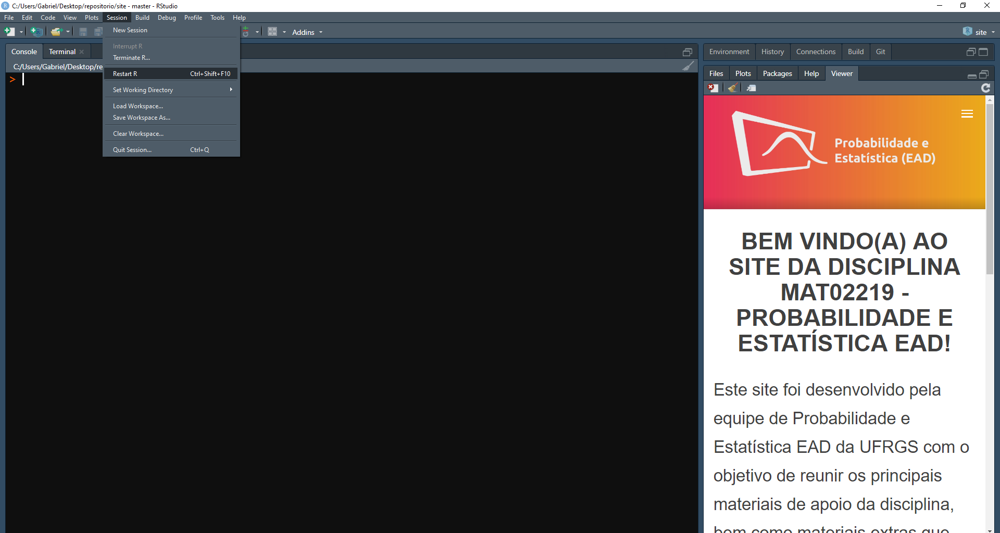

2 - Exclua todos os arquivos da pasta public

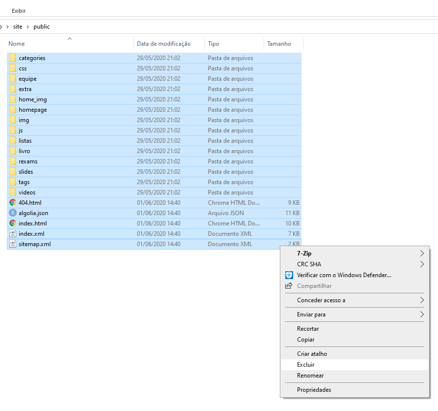

3 - Rode o comando `blogdown::build_site()`. A diferença entre o `serve_site()` e o `build_site()` é que o primeiro gera o site para ser visualizado localmente, enquanto que o segundo gera o site para dar o deploy da pasta public no domínio. Ambos modificam o conteúdo da pasta public para cumprir o seu propósito, por isso é necessário excluir os arquivos gerados pelo `serve_site()` antes de rodar o `build_site()`.

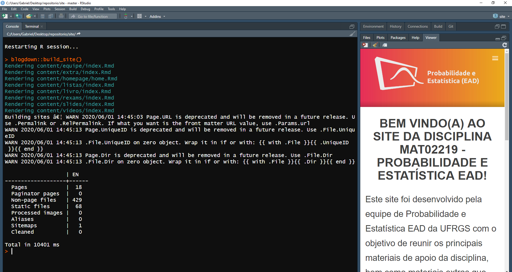

4 - Ao lado da aba Console, clique na aba Terminal e digite o seguinte comando `git pull origin master`. Esse comando adiciona quaisquer modificações em arquivos que estão no repositório do github mas não no seu repositório local. É importante usar esse comando para se certificar que você não estará sobrescrevendo alterações feitas por outros usuários na branch master, e seu repositório ficará igual ao do github.

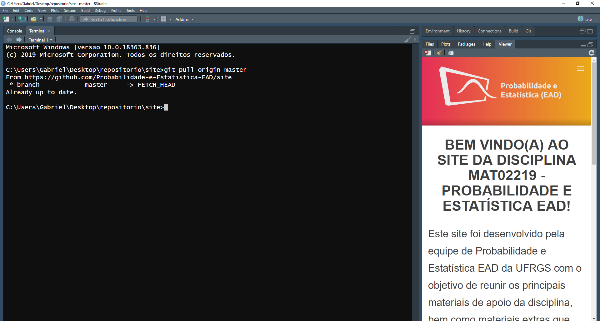

5 - Rode o comando `git add --all`


6 - Em seguida, digite o comando `git commit -m "MENSAGEM DO COMMIT"`

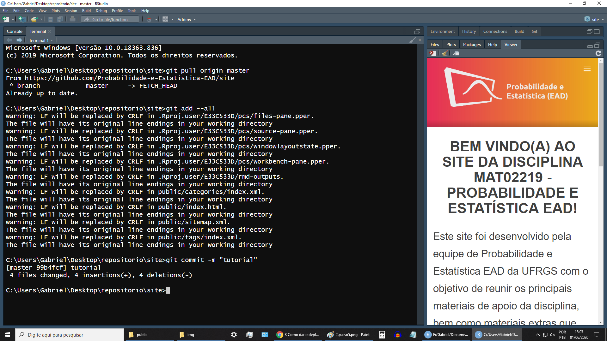

7 - Digite o comando `git push origin master` e suas alterações estarão no github.

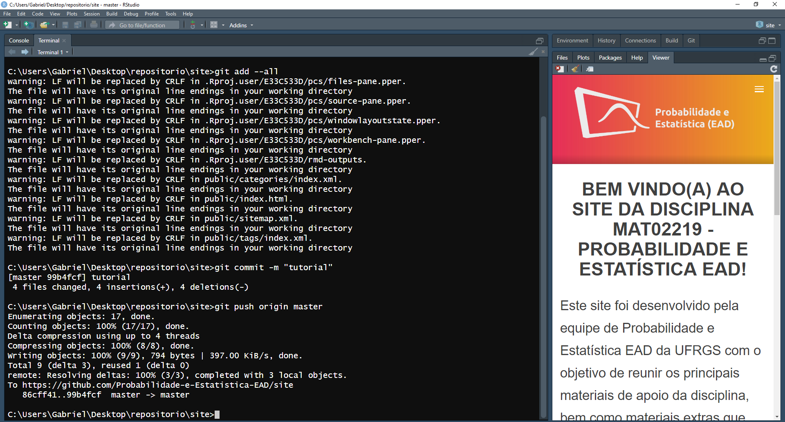

8 - Por fim, use algum software para dar o deploy no domínio UFRGS, como o FileZilla, lembrando que apenas a pasta public será upada, pois ela é o site.


# Perguntas e respostas

## Caso o endereço do site mude, como "comunico" isso ao blogdown?

config.toml -> baseurl

## Como mudar o título do site que aparece na guia do browser?

config.toml -> title

## Como mudar o número de posts que aparecem por vez em uma página na aba Blog?

config.toml -> paginate


## Como mudar a imagem de fundo?

Colque a imagem nova em static/img e altere o endereço em config.toml -> header_image

## Como mudar a imagem de erro 404?

Colque a imagem nova em static/img e altere o endereço em config.toml -> image_404

## Como mudar o texto da página de erro 404?

config.toml -> title_404

## Como adicionar um novo menu superior?

Vá em content e crie uma nova pasta, aqui você pode escolher o nome para a pasta que você preferir.

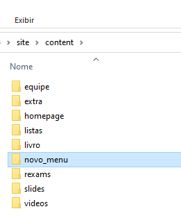

Crie um novo arquivo em Rmarkdown no formato abaixo:

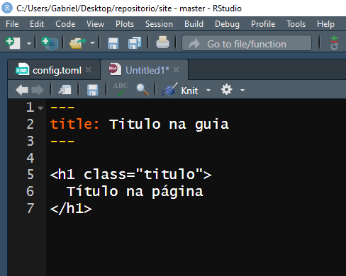

No yaml, o argumento title será o texto mostrado na guia do browser quando o usuário estiver acessando o menu. O comando `h1` em html é equivalente ao `#` do Rmarkdown, mas recomendo que usem para o título na página essa estrutura pois `class="titulo"` é um bloco de código em css que programei para a fonte ficar maior que o normal quando o `h1` tiver essa classe (arquivo em themes/hugo-theme-cleanwhite/static/css/hux-blog.min.css). Depois do título, o resto do arquivo pode ser escrito como um Rmarkdown normal.

Salve o arquivo com o nome `index.Rmd`.

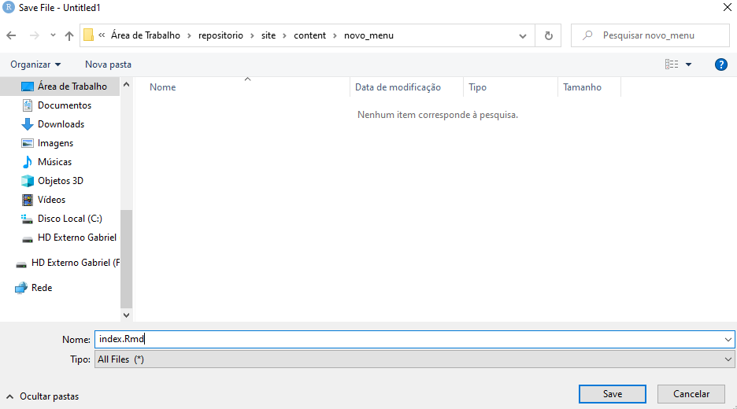

A função `serve_site()` irá renderizar o Rmd para html automaticamente (senão, salve algum arquivo para a função renderizar o site novamente ou rode o `serve_site()` de novo).

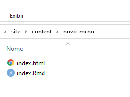

A página já está na pasta public (ou seja, já está no site), mas agora precisamos informar ao site que queremos que a página seja exibida como menu superior.

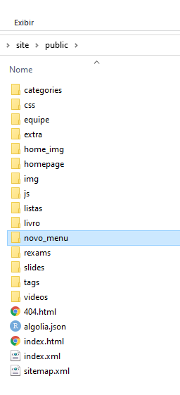

Se olharmos a prévia do site, o novo menu não foi adicionado.

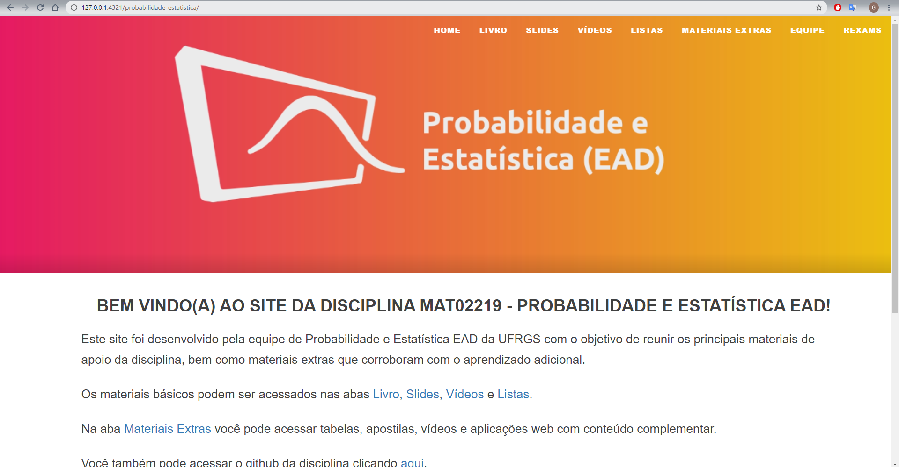

Mas se digitarmos manualmente o endereço da pasta na url, temos como acesar a página.

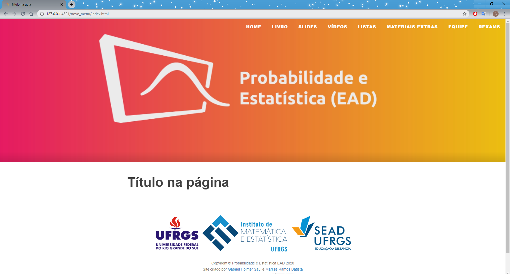

Obviamente, o usuário não vai adivinhar que existe um menu escondido no site, então se quisermos que ele o acesse, precisamos adicionar a página como um menu superior.

Vá em config.toml, no final do arquivo você deve ver um bloco de código parecido com isto:

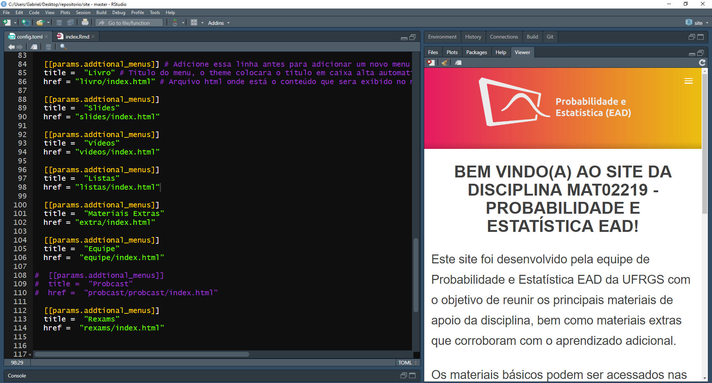

[[params.addtional_menus]] = Declara que você quer adicionar um novo menu

title =  "Título do menu" = Informa o título do menu, note que o site sempre põe o texto em caixa alta.

href = "pasta_do_menu/index.html" = Endereço do arquivo html transformado pelo serve site apartir do Rmd.

Adaptando o exemplo:

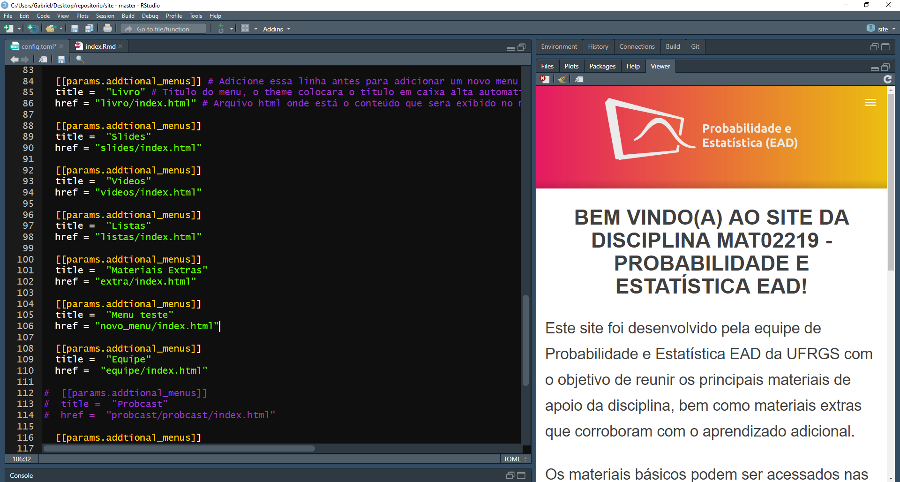

Note o título na guia no canto superior esquerdo, o título na página e o nome menu teste na linha de menus.

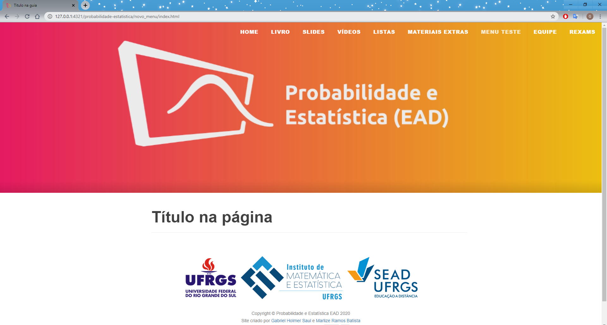


## Como mudar o conteúdo de um menu superior?

Leia "Como adicionar um novo menu superior?" antes.

Vá em content/pasta_do_menu_que_deseja_alterar/index.Rmd

Como o arquivo é um Rmarkdown, a alteração é igual a de um Rmarkdown qualquer.

## Como trocar a ordem dos menus superiores?

Leia "Como adicionar um novo menu superior?" antes.

Em config.toml, desça até chegar nos blocos de código referentes aos menus. A ordem dos menus é a ordem dos blocos de código. Se eu quisesse que o menu teste ficasse entre livro e slides, bastaria deixar o bloco de código entre os dois no config.toml. As ordem das abas home e blog são tratadas de maneira diferente.

## Como remover um menu superior?

Leia "Como adicionar um novo menu superior?" antes.

1 - Vá em config.toml e exclua o bloco de código correspondente ao menu

2 - Exclua a pasta do menu em content

3 - Exclua todos os arquivos da pasta public para garantir que não haverá resquícios do menu no site.


## Como mudar a homepage?

O tema do site, cleanwhite, foi criado para ser um blog pessoal. Por default, a homepage é a lista de todos os posts que a pessoa criou. Para mostrar uma página fixa ao invéz da lista de posts, foi necessário fazer uma "gambiarra" no site. Assim, os passos para modificar o conteúdo da homepage são os seguintes:

Vá em content/homepage/home.Rmd e faça as alterações desejadas no arquivo (note que o arquivo não tem nome index.Rmd, mas você verá que para este caso isso não importa).

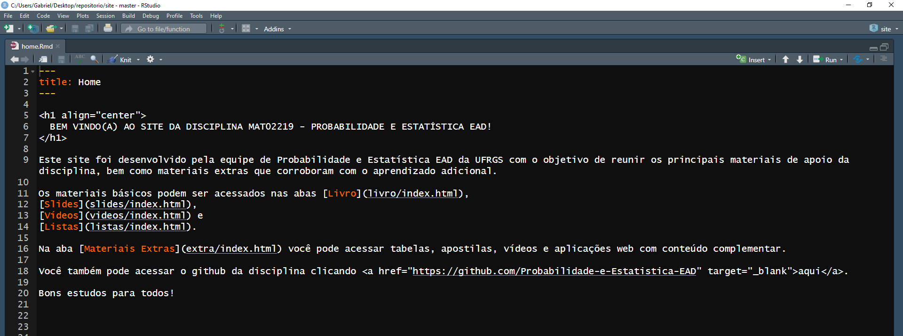

Salve o arquivo e isso irá ativar a função `serve_site()`, que irá transformar o arquivo Rmd em html. Abra o arquivo content/homepage/home.html e copie tudo menos as três primeiras linhas com o título.

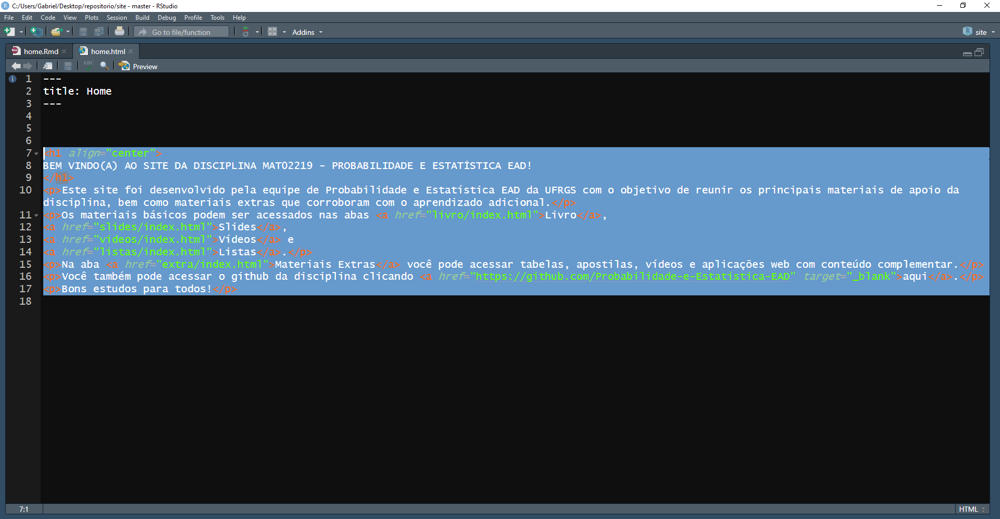

Vá em themes/hugo-theme-cleanwhite/layouts/partials/homepage.html e cole o código que você copiou entre os blocos de comentários "AQUI VAI O CODIGO HTML DO POST" e "AQUI ACABA O POST".

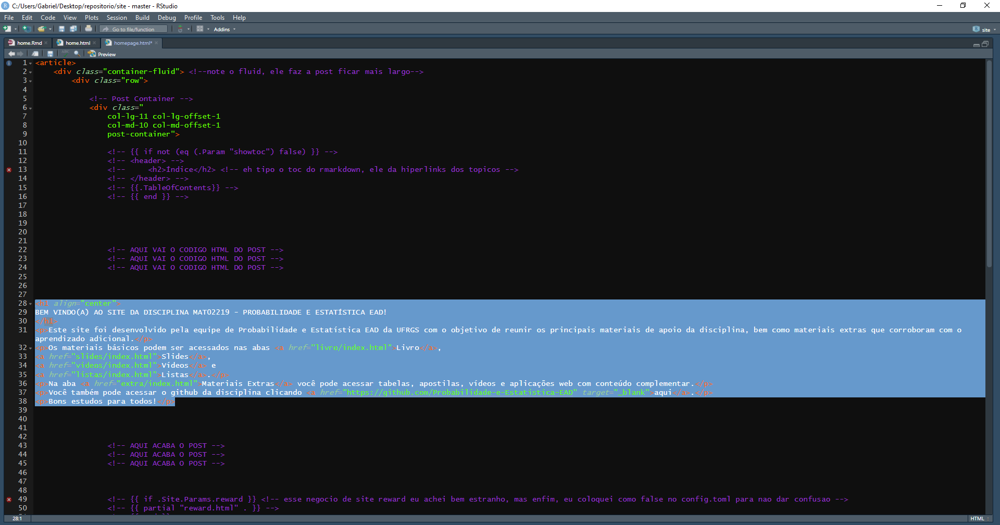

O arquivo homepage.html é a própria homepage, o que está no arquivo que não é conteúdo é responsável pela estrutura da página, apenas o que estiver entre os dois blocos de comentário é o conteúdo em html dá página. Seria possível programar a homepage direto em html, mas como o `Blogdown` renderiza o Rmd para html, somente é necessário mudar o Rmd.

O arquivo que realmente é responsável pela homepage, na verdade, é o themes/hugo-theme-cleanwhite/layouts/index.html

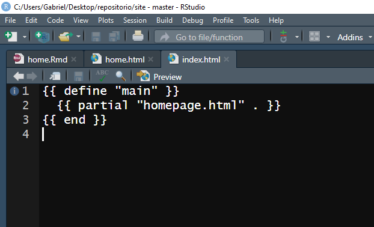

Esse arquivo mostra a homepage baseado em algum arquivo, aqui não é necessário modificar nada, é apenas para explicar como a homepage *realmente* é gerada.

Resumindo:

* Modifique o content/homepage/home.Rmd
* Rode o `serve_site()`
* Copie quase todo o conteúdo de content/homepage/home.html
* Cole no local indicado em themes/hugo-theme-cleanwhite/layouts/partials/homepage.html
* Rode o `serve_site()` novamente 


## IMPORTANTE: Como funcionam os endereços de arquivos dentro dos códigos?

Como motivação, veja o arquivo content/listas/index.Rmd:

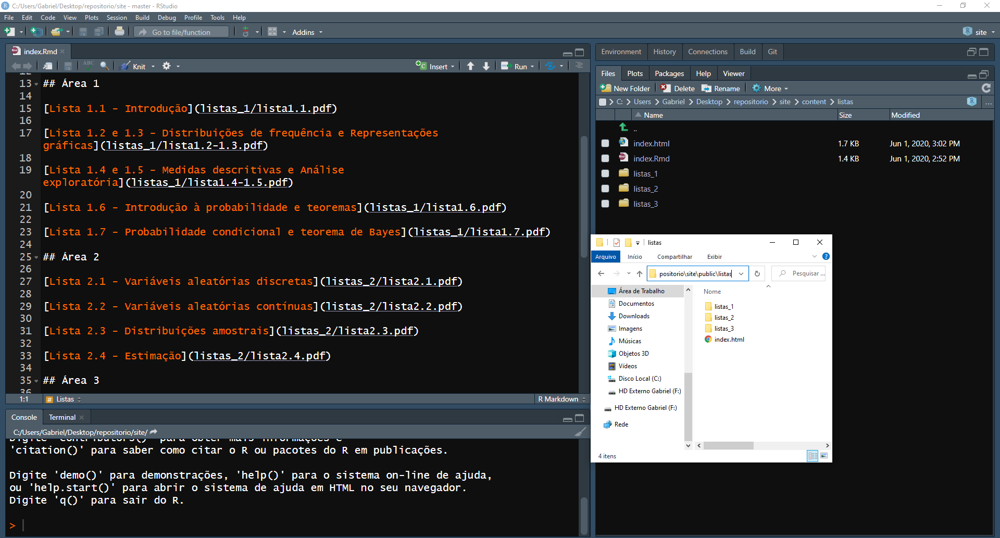

No diretório do arquivo index.Rmd estão as pastas com os arquivos em pdf, portanto, o endereço para os pdf's são do estilo 


