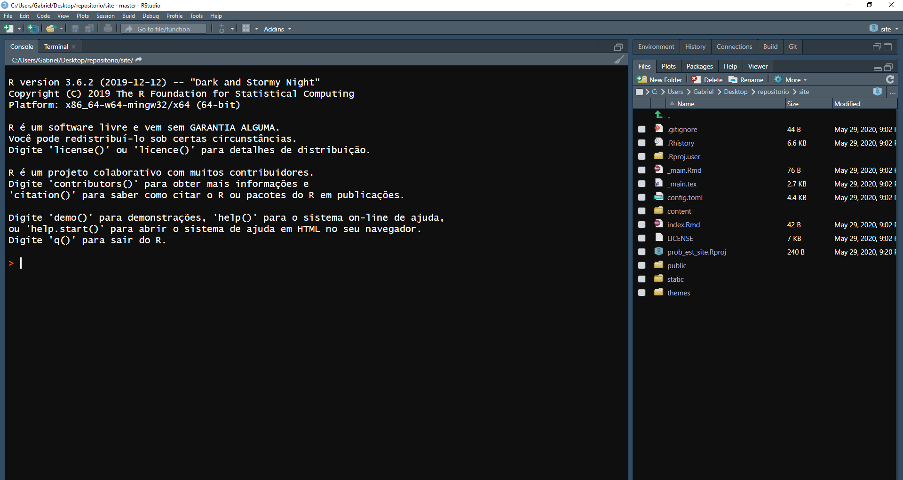
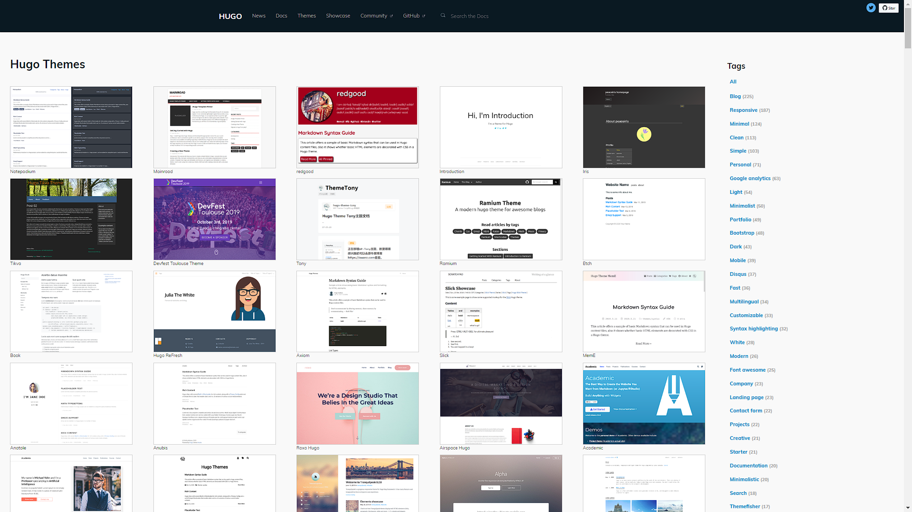
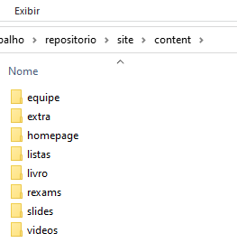
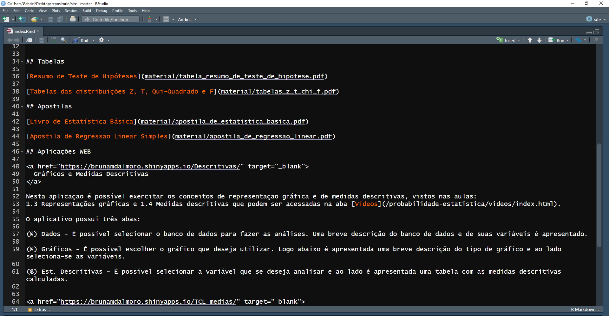
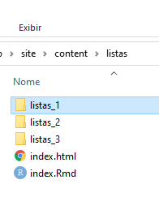
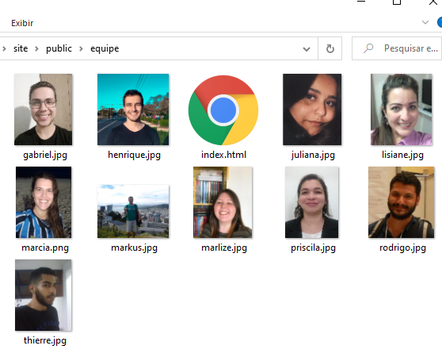

# Prefácio {-}

Este material foi escrito no semestre de 2020/1, no qual a professora Márcia Barbian me deu a tarefa de construir um site para a disciplina de MAT02219 - Probabilidade e Estatística EAD. O objetivo deste material é fornecer um guia para que professores, monitores e colaboradores da disciplina possam fazer a manutenção do site sem precisar aprender o funcionamento do pacote `Blogdown` e do `Hugo` do zero.

Eu assumo que a pessoa que estiver lendo este material sabe pouco ou nada de programação em html, css ou java script e que também não sabe como o pacote `Blogdown` do R e o gerador de sites estáticos `Hugo` funcionam. Eu não tenho conhecimento aprofundado em nenhuma dessas ferramentas citadas, não esperem nada muito profissional aqui, apenas o necessário para gerir o site.

Por fim, estou assumindo que o repositório do site ainda se encontra em [https://github.com/Probabilidade-e-Estatistica-EAD/site](https://github.com/Probabilidade-e-Estatistica-EAD/site).

# Como rodar o site localmente

1 - Escolha o diretório onde a pasta do projeto irá ficar. Como exemplo, criei uma pasta com alguns projetos e incluirei o site como um deles.


2 - Digite "cmd" no endereço da pasta e tecle enter, isso vai abrir o prompt de comando na pasta


3 - Assumindo que você tenha o git instalado no seu computador, digite o comando `git clone https://github.com/Probabilidade-e-Estatistica-EAD/site`. Isso irá clonar o repositório do github e linkar o projeto do R ao endereço do repositório.


4 - Agora que a pasta do site está no nosso repositório, abra o arquivo `prob_est_site.Rproj`




5 - Baixe o pacote `Blogdown` e o `Hugo` usando os comandos abaixo

```{r eval=FALSE, echo=TRUE, warning=FALSE,message=FALSE}

install.packages('blogdown')
blogdown::install_hugo()

```

6 - Na aba `Addins` clique em `Serve Site`, ou rode o comando `blogdown::serve_site()` no console. Este comando irá servir o site em um servidor local o que nos permitirá ver o site.

 


7 - O ambiente deve se parecer com isto


Para visualizar o site no browser, clique na opção "Show in new window" na aba "Viewer".

Não é possível ver o website de outra maneira a não ser esta. Não há um arquivo html que possamos abrir e facilmente ter uma visão geral, como no output em html do Rmarkdown.

# Pastas e arquivos principais

No projeto, algumas pastas e arquivos têm importância fundamental para a construção do site e na maioria dos casos **precisam** ter um nome específico. Vamos ver algumas delas agora. 

## public

A pasta public é o site propriamente dito. Ao executar a função `serve_site()`, todos os arquivos de outras pastas têm o propósito de agregar conteúdo ao site ou juntar os pedaços de código espalhados pelo diretório afim de criar o site.


Se você já usou o pacote `Bookdown`, deve ter notado que ele cria mais de um arquivo html e também algumas pastas, diferente do output em html do Rmarkdown, que é apenas um arquivo html. Isso acontece porque no `Bookdown`, cada html é um capítulo ou subcapítulo do livro; o mesmo acontece com o site, existem vários arquivos html dentro da pasta public, pois cada página do site é um html diferente. No `Bookdown`, as pastas que ele gera contém arquivos que dão a aparência suave e estilosa para os html's gerados. Sem elas, os arquivos terão uma aparência rústica, tipo o google da década de 90. O mesmo ocorre para o site, aquelas várias pastas modificam diferentes detalhes, como fonte, alinhamento, design...

## themes

Aqui ficam os arquivos detalhistas de programação html, css e javascript.



O Hugo possuí vários temas diferentes e cada um deles mantém mais ou menos a mesma estrutura de site. Eles tem maneiras similares de adicionar um post, uma imagem ou um menu superior, mas mesmo assim eles tem aparências diferentes. O que modifica essa aparência (tamanho da fonte, cor de fundo, se algum botão terá ou não uma animação) são os arquivos da pasta themes. A maior parte das alterações relacionadas à estrutura do site serão feitas dentro desta pasta. 

## content

Aqui ficam os posts e menus superiores.




Vejamos como os arquivos desta pasta funcionam com um exemplo. Em extra/index.Rmd (é fortemente recomendável que o nome dos arquivos dessas pastas seja index).



O arquivo que dá conteúdo ao menu Materiais Extras é um arquivo em Rmarkdown (.Rmd), então sabendo usar essa "linguagem" é possível alterar o conteúdo desse menu a vontade. Note que foram adicionados alguns códigos em html, que o Rmarkdown reconhece, para deixar a aparência do site mais sólida.


A maioria dos arquivos que a página irá usar também precisa estar na pasta. Veja, por exemplo, a pasta listas.




## static

Arquivos que serão adicionados às páginas, como pdf's, ficam na pasta content. Com excessão de imagens, que ficam na pasta static. Na verdade, a pasta static serve apenas para guardar imagens que serão usadas nos posts. Vejamos o exemplo da pasta equipe.


Como o nome da pasta em content e static é igual (isso é necessário), o `Blogdown` irá mesclar as duas pastas, e no public ficará assim.



Isso facilita muito a programação da página, pois o endereço da imagem no código assume que as imagens estarão no mesmo diretório final.

## config.toml

# Como dar o deploy do site para o endereço UFRGS

1 - Se você terminou as alterações do site e rodou o comando `Serve Site`, recomendo reiniciar o R para interromper atualização automática e impedir que o comando adicione arquivos à pasta public.


2 - Exclua todos os arquivos da pasta public


3 - Rode o comando `blogdown::build_site()`. A diferença entre o `serve_site()` e o `build_site()` é que o primeiro gera o site para ser visualizado localmente, enquanto que o segundo gera o site para dar o deploy da pasta public no domínio. Ambos modificam o conteúdo da pasta public para cumprir o seu propósito, por isso é necessário excluir os arquivos gerados pelo `serve_site()` antes de rodar o `build_site()`.


4 - Ao lado da aba Console, clique na aba Terminal e digite o seguinte comando `git pull origin master`. Esse comando adiciona quaisquer modificações em arquivos que estão no repositório do github mas não no seu repositório local. É importante usar esse comando para se certificar que você não estará sobrescrevendo alterações feitas por outros usuários na branch master, e seu repositório ficará igual ao do github.


5 - Rode o comando `git add --all`


6 - Em seguida, digite o comando `git commit -m "MENSAGEM DO COMMIT"`


7 - Digite o comando `git push origin master` e suas alterações estarão no github.


8 - Por fim, use algum software para dar o deploy no domínio UFRGS, como o FileZilla, lembrando que apenas a pasta public será upada, pois ela é o site.


